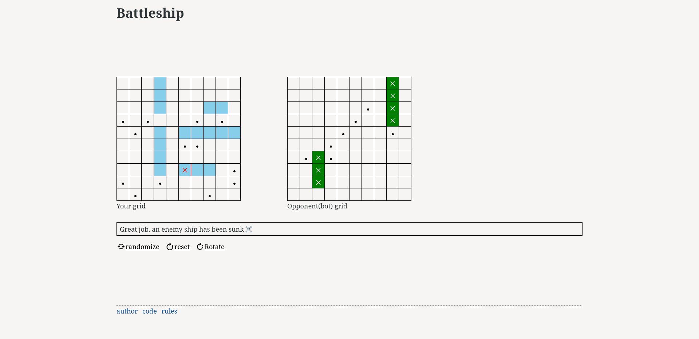

# Battleship

Battleship is an assignment project within the curriculum of [theOdinProject](https://theodinproject.com/) to practice Test-Driven Development (TDD). I kept the interface simple to focus on logic. Feel free to try the live version by [clicking here](https://arrahhal.github.io/battleship).

> Battleship (also known as Battleships or Sea Battle) is a strategy type guessing game for two players. It is played on ruled grids (paper or board) on which each player's fleet of warships are marked. The locations of the fleets are concealed from the other player. Players alternate turns calling "shots" at the other player's ships, and the objective of the game is to destroy the opposing player's fleet. [wikipedia](<https://en.wikipedia.org/wiki/Battleship_(game)>)
